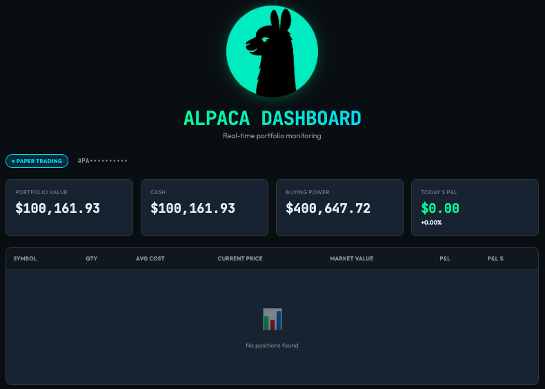

# Alpaca Dashboard



A sleek, mobile-optimized web dashboard for monitoring your Alpaca trading account in real-time. Built with vanilla HTML, CSS, and JavaScript—no frameworks required.


## Features

- 📱 **Mobile-First Design** - Optimized for mobile but looks great on desktop too
- 🎨 **Modern UI** - Dark theme with smooth animations and gradient effects
- 🔒 **Secure** - API credentials never leave your browser
- ⚡ **Real-Time Updates** - Auto-refreshes every 30 seconds
- 📊 **Portfolio Overview** - View equity, cash, buying power, and daily P&L at a glance
- 📈 **Position Tracking** - Monitor all positions with profit/loss calculations
- 🔄 **Auto-Detection** - Automatically detects Paper vs Live trading accounts

## Getting Started

### Prerequisites

- An Alpaca trading account (sign up at [alpaca.markets](https://alpaca.markets))
- API Key and Secret from your Alpaca account

### Installation

1. Clone this repository:
```bash
git clone https://github.com/JustinOros/alpaca-dashboard.git
cd alpaca-dashboard
```

2. Open `index.html` in your web browser

That's it! No build process, no dependencies to install.

## Usage

Access Alpaca Dashboard using GitHub Pages:
[https://justinoros.github.io/alpaca-dashboard](https://justinoros.github.io/alpaca-dashboard)

Or...

1. Open `index.html` in your web browser
2. Enter your Alpaca API Key and API Secret
3. Click **GO!** to connect to your account
4. View your portfolio data and positions

The dashboard will automatically:
- Detect whether you're using Paper or Live trading credentials
- Refresh your data every 30 seconds
- Display real-time profit/loss with color-coded indicators

## Getting Your API Credentials

1. Log in to your Alpaca account at [app.alpaca.markets](https://app.alpaca.markets)
2. Navigate to **Paper Trading** or **Live Trading** (depending on which you want to use)
3. Go to **Your API Keys** section
4. Generate or view your API Key and Secret Key
5. Copy both values into the dashboard login form

⚠️ **Security Note**: Keep your API credentials secure. Never share them or commit them to version control.

## API Endpoints

The dashboard connects to:
- **Paper Trading**: `https://paper-api.alpaca.markets`
- **Live Trading**: `https://api.alpaca.markets`

It automatically tries Paper first, then Live, based on your credentials.

## Displayed Information

### Account Summary
- **Portfolio Value** - Total equity in your account
- **Cash** - Available cash balance
- **Buying Power** - Amount available for trading
- **Today's P&L** - Profit/loss for the current trading day with percentage

### Positions Table
- Symbol
- Quantity
- Average Cost
- Current Price
- Market Value
- Unrealized P&L (dollar amount)
- Unrealized P&L (percentage)

## Browser Compatibility

Works on all modern browsers:
- ✅ Chrome/Edge (recommended)
- ✅ Firefox
- ✅ Safari
- ✅ Mobile browsers (iOS Safari, Chrome Mobile)

## Security Considerations

- ✅ API credentials are stored only in memory while logged in
- ✅ No server-side components—everything runs in your browser
- ✅ No data is sent to any third-party services
- ✅ Password input fields prevent credential exposure
- ⚠️ For additional security, consider using read-only API keys if Alpaca supports them
- ⚠️ Always log out when finished, especially on shared devices

## Limitations

- Read-only dashboard (no trading functionality)
- Requires active internet connection
- No historical data or charts
- Session ends when you close the browser tab or click logout

## Contributing

Contributions are welcome! Please feel free to submit a Pull Request.

1. Fork the project
2. Create your feature branch (`git checkout -b feature/AmazingFeature`)
3. Commit your changes (`git commit -m 'Add some AmazingFeature'`)
4. Push to the branch (`git push origin feature/AmazingFeature`)
5. Open a Pull Request

## License

This project is licensed under the MIT License - see the [LICENSE](LICENSE) file for details.

## Disclaimer

This dashboard is for informational purposes only. It is not financial advice and should not be used as the sole basis for investment decisions. Always verify information directly with Alpaca and consult with a qualified financial advisor before making investment decisions.

The developer is not affiliated with Alpaca Markets and is not responsible for any losses incurred through the use of this dashboard.

## Acknowledgments

- [Alpaca Markets](https://alpaca.markets) for their excellent API
- Font families: JetBrains Mono and Outfit from Google Fonts
- Inspired by modern trading terminals and fintech interfaces

## Support

For issues and questions:
- Open an issue on [GitHub Issues](https://github.com/yourusername/alpaca-dashboard/issues)
- Check Alpaca's [API Documentation](https://docs.alpaca.markets)
- Visit [Alpaca Community Forum](https://forum.alpaca.markets)

---

**Made with ☕ for traders who want a clean, simple portfolio view**
